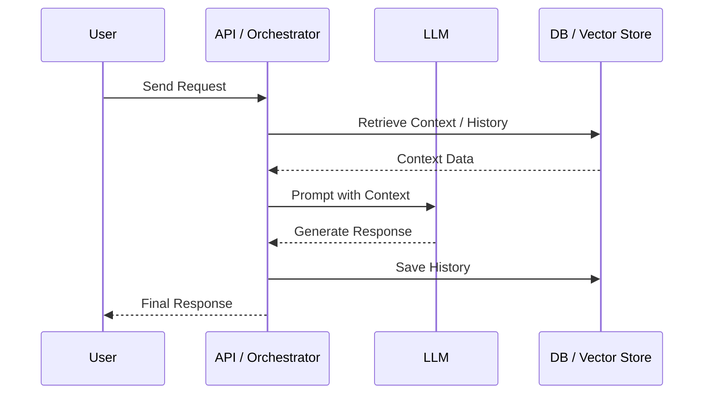
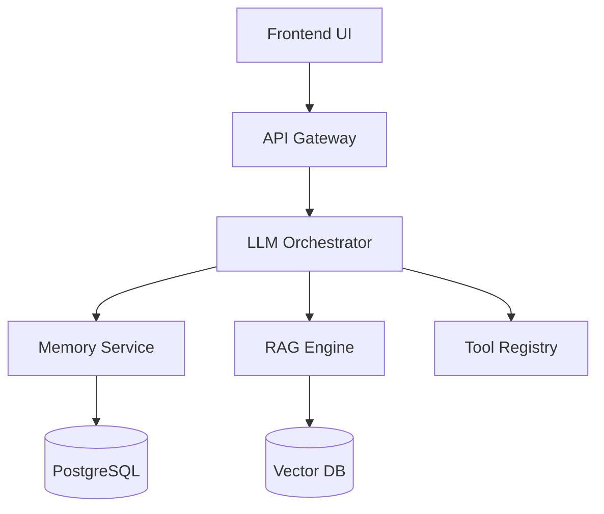

# Architecture Design Skill

當使用者要求進行系統設計、技術選型或架構規劃時，請遵循此指南。此技能旨在協助使用者構建穩健、可擴展且符合 AI 特性的架構。

## 指導原則
1. **模組化設計**：強調元件之間的低耦合。
2. **圖表驅動**：儘可能使用 Mermaid 語法產出流程圖 (Flowchart) 與時序圖 (Sequence Diagram)。
3. **權衡分析 (Trade-off)**：在提供方案時，說明優缺點 (Pros & Cons)。
4. **AI 整合模式**：針對 LLM 應用，特別考慮 RAG、Memory 管理與 Tool Use 機制。

## 常用架構模板 (Mermaid)

### 時序圖 (Sequence Diagram)

### 元件圖 (Component Diagram)

## 核心設計檢查清單
- **Scaling**: 系統如何處理高流量？
- **Reliability**: 當 LLM API 逾時或出錯時的降級處理 (Fallback)。
- **Data Privacy**: 敏感資料是否在發送到模型前已處理？
- **State Management**: 跨會話的一致性如何維持？
