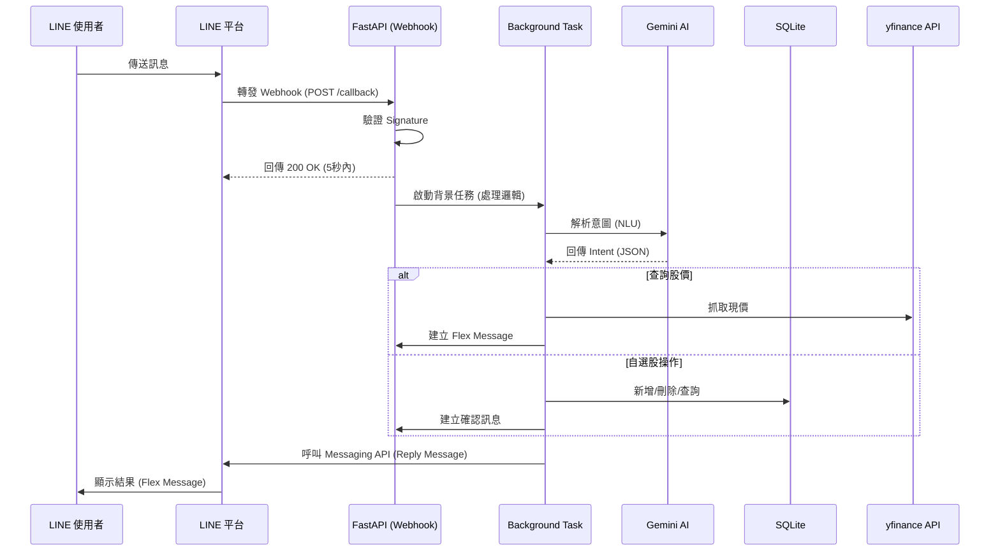

# 系統架構文件 (Architecture)

## 1. 系統流程圖 (Request Flow)

## 2. 模組職責說明

| 模組 | 職責 |
| :--- | :--- |
| **app.py** | 系統入口、Webhook 接收、簽章驗證、路由配置。 |
| **database.py** | 使用 `aiosqlite` 處理資料庫初始化、自選股 CRUD 操作。 |
| **ai_service.py** | 整合 Google Generative AI SDK，將使用者文字轉化為結構化指令。 |
| **stock_service.py** | 封裝 `yfinance`，提供統一的股價獲取介面與錯誤處理。 |
| **flex_builder.py** | 負責將資料轉化為符合 LINE Flex Message 規格的 JSON。 |

## 3. 資料庫設計 (Database Schema)

### Table: `watchlist`
| 欄位 | 型別 | 說明 |
| :--- | :--- | :--- |
| `id` | INTEGER | PRIMARY KEY (Auto Increment) |
| `user_id` | TEXT | LINE 提供的唯一使用者 ID |
| `symbol` | TEXT | 股票代號 (如 2330.TW) |
| `created_at` | TIMESTAMP | 加入時間 |

## 4. 關鍵技術點 (Technical Highlights)

1.  **異步併發**：所有 I/O 密集型操作 (DB, AI API, Stock API) 均採用 `async/await`，最大化系統吞吐量。
2.  **超時防範**：利用 FastAPI 的 `BackgroundTasks`，在 200ms 內完成驗證並釋放連接，將邏輯運算移至背景執行。
3.  **錯誤彈性**：AI 解析失敗時，系統將自動降級回正則表達式 (Regex) 匹配基本指令。
4.  **Premium UI**：所有股票查詢結果皆以 `FlexMessage` 呈現，優化行動端視覺體驗。
